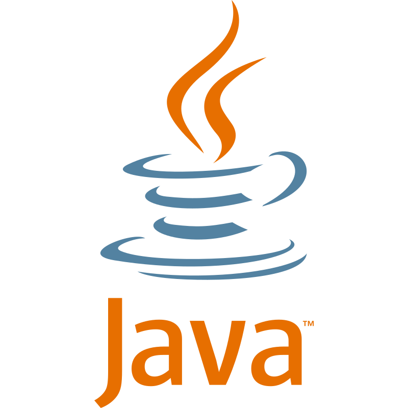

<h1 align="center">Hi, I'm Yassine Cheniour 👋</h1>

<h3 align="center">
  Data Engineer / Data Scientist 
</h3>

  
  
  

---

## About Me

I am a Data Engineer and Data Scientist specializing in Data Engineering and Machine Learning / AI, with a strong interest in building reliable data pipelines, transforming raw data into actionable insights, and deploying scalable analytics solutions.

Driven by problem-solving and technical challenges, I enjoy working across the full data lifecycle: data collection, processing, modeling, and deployment. My recent experiences have strengthened my skills in data engineering, AI development, monitoring, automation, and deploying end-to-end data solutions in real operational environments.

I am particularly passionate about Large Language Models and AI agents, and enjoy exploring the intersection of Data Engineering and Artificial Intelligence to build intelligent, data-driven systems.

---

## 💼 Professional Experience

| Role | Company | Period | Key Responsibilities |
|------|---------|--------|----------------------|
| **Data Engineer** (Cloud & Data Platform) | ADDEV Materials | Mar 2026 – Present | - Designed and developed data flows using **Matillion** and **Talend** - Added components to the data platform (API/FTP integrations) - Assisted in the administration of a **Snowflake** data warehouse - Set up and improved monitoring/supervision tools - Worked extensively with **AWS** cloud services: storage (**S3**), compute (**EC2**), and serverless functions (**Lambda**) - Documented all tasks and workflows |
| **Junior Data Engineer** (Monitoring & Data Processing) | Enedis (DSI) | Apr 2024 – Sep 2025 | - Worked in an Agile workflow (Kanban, ticketing) - Data processing with **Python, Kafka** & **Elasticsearch** - Versioning & development with **GitLab** & **Jenkins** across VMs - Built workflows on the **Teradata** data warehouse - Advanced SQL queries for extraction and validation - Log-processing pipelines for application monitoring - Created dashboards using **Grafana** and **Power BI** |
| **HR & Payroll Assistant** | Vinci Facilities | Apr – June 2022 | - Processed payroll and HR data with accuracy - Managed administrative workflows for HR operations - Ensured data consistency and compliance |

---

## 🎓 Education

**Master 2 – Statistics & Computer Science for Data Science (SISE)**  
📍 Université Lumière Lyon 2 | 2025–2026
 
**Master – Advanced Information Systems (Systèmes d'Information Avancés — SIA)**  
📍 IAE Lyon | 2023–2025

**Bachelor's in Economics & International Management**  
📍 IAE Angers | 2021–2023

--- 

## 🚀 Projects

| Project | Description | Tech Stack |
|---------|-------------|-------------|
| **[Emergency Manager](https://github.com/YassineCHN/Emergency_manager)** | Intelligent multi-agent system for emergency department patient flow optimization. Combines RAG (medical protocols), MCP server, ML-based prompt injection guardrail, and real-time Streamlit dashboard. | Python, RAG, MCP, Streamlit |
| **[Job Market Analyser — RUCHE](https://github.com/YassineCHN/SISE_RUCHE)** | NLP & Text Mining platform for analyzing the French Data/AI job market. End-to-end pipeline: web scraping (France Travail, APEC, JobTeaser), MongoDB storage, ETL to a star-schema data warehouse on MotherDuck, semantic vector search, and an interactive Streamlit app (maps, clustering, LLM chatbot via Mistral). 6,000+ job offers collected. | Python, MongoDB, MotherDuck, DuckDB, Streamlit, Selenium, Mistral AI, Docker |
| **[Firewall Log Analyser — OPSISE](https://github.com/YassineCHN/SISE_OPSISE)** | Streamlit platform for analyzing firewall logs (4.5M+ lines). Features interactive dashboards, geographic IP mapping via pydeck, ML anomaly detection (Isolation Forest + Random Forest) with 4 behavioral profiles (Scanner, Brute-Force, Flood, Normal), temporal Z-score analysis, and an automated threat report generator via Mistral AI. Deployed on Streamlit Cloud. | Python, Streamlit, DuckDB, MotherDuck, Scikit-learn, Plotly, Pydeck, Mistral AI |
| **[Kubernetes Workshops](https://github.com/YassineCHN/SISE_Atelier_K8s)** | Practical Kubernetes workshops covering core concepts (Pods, Deployments, Services, Namespaces), deployment strategies (Rolling Update, Blue/Green, Canary), a full batch data pipeline (MinIO, dbt, FastAPI, CronJobs), and a complete MLOps stack (PostgreSQL, MLflow, FastAPI, Streamlit, HPA). | Kubernetes, Docker, FastAPI, Streamlit, MLflow, MinIO, dbt, DuckDB |
| **[Controller Profiler — Ultimate Games](https://github.com/YassineCHN/SISE_ULTIMATE_GAMES)** | Real-time player behavioral profiling via Xbox/PlayStation controller inputs. 4 Pygame mini-games capture inputs at 30 Hz and extract 20 behavioral features. ML pipeline (UMAP + K-Means) classifies players into 4 profiles. Includes an AI imitator agent replaying recorded player patterns, a Mistral AI coach, and a real-time Dash dashboard with leaderboard and post-session summaries. | Python, Pygame, Dash, Scikit-learn, UMAP, Supabase, Mistral AI |
| **[Simpsons Character Detection — DeepSpringfield](https://github.com/YassineCHN/SISE_DeepSpringfield)** | Object detection project to automatically locate the 5 main Simpsons characters (Bart, Homer, Lisa, Maggie, Marge) in images using YOLOv8 and transfer learning from COCO weights. Best model (YOLOv8s) achieves mAP@50 of 0.877 on the test set across 163 annotated images. | Python, YOLOv8, PyTorch, Google Colab |
| **[MLOps Pipeline — Iris](https://github.com/YassineCHN/SISE_MLOPS)** | End-to-end MLOps pipeline for Iris classification with experiment tracking, model registry, and automated orchestration. FastAPI backend exposing training and prediction endpoints for 3 algorithms (Random Forest, SVM, Logistic Regression), automatic MLflow logging, configurable label corruption, and 3 Airflow DAGs for parallel scheduled training. 7-service stack deployed via Docker Compose. | Python, FastAPI, Streamlit, MLflow, Airflow, Scikit-learn, PostgreSQL, Docker |
| **[SISE_ENEDIS](https://github.com/YassineCHN/SISE_Enedis/tree/main)** | End-to-end ML pipeline with automatic data extraction from the ADEME API, preprocessing, and training models to predict DPE class (A–G) and energy consumption. Delivered as a full web app (Streamlit + FastAPI) and deployed in Docker with model/data sync via Hugging Face and hosting on Koyeb. | Python, Scikit-learn, FastAPI, Streamlit, Docker |
| **[R Package for Variable Clustering](https://github.com/YassineCHN/SISE_CLUSTVAR_PACKAGE)** | Developed an R package implementing advanced quantitative & qualitative variable clustering (K-Means, VarClus, MCA-HAC), with visualizations and a full Shiny application for interactive exploration. Includes 200+ unit tests and multiple built-in datasets. | R, R6, Shiny |
| **[Dataiku Workshop](https://github.com/YassineCHN/atelier_dataiku/)** | Built a complete learning pipeline on Dataiku Cloud: ETL workflows, credit-scoring models, fraud-detection (XGBoost) on imbalanced data, automated pipelines, model interpretability, and deployment of a prediction API. | Dataiku |
| **[JAVA(J2EE) Hospital Management System](https://github.com/YassineCHN/ProjetJava)** | Full Java EE application for managing outpatient hospitalizations: multi-role authentication, patient records, scheduling, medical acts, service management, billing workflows, and administrative operations. Built with MVC architecture and servlets/JSP. | Java, J2EE, SQL |
| **[SNCF Seat Occupancy API](https://github.com/YassineCHN/PFE)** | Developed a backend application simulating SNCF's seat-occupancy service: retrieving occupation data per station, tracking seat usage across the entire route, and computing train-wide occupancy rates. Implemented endpoints and business logic based on official SNCF functional specifications. | Python, REST API |
| **[Power BI – COVID-19 Dashboard](#)** | Designed an interactive dashboard exploring COVID-19 indicators, trends, and KPIs using public datasets. | Power BI |
| **[Django Python Application](#)** | Created a full-stack Django web application with backend logic, templates, and data persistence. | Python, Django |
 
---

## 🛠️ Tech Stack

### 🧑‍💻 Programming Languages

  &nbsp;
  &nbsp;
  &nbsp;
  &nbsp;

**Other:** Shell Linux, Bash, CMD
 
### ⚙️ Data Engineering & Big Data

  &nbsp;
  &nbsp;
  &nbsp;
  &nbsp;
  &nbsp;
  &nbsp;

**Other:** Talend, Matillion, Apache Hop, Apache Doris, Apache NiFi
 
### ☁️ Cloud & MLOps

  &nbsp;
  &nbsp;
  &nbsp;
  &nbsp;
  &nbsp;
  &nbsp;

**Other:** AWS (S3, EC2, Lambda, SQS), Snowflake, Matillion
 
### 📦 Databases & Storage

  &nbsp;
  &nbsp;
  &nbsp;
  &nbsp;
  &nbsp;
  &nbsp;

**Other:** Redis, SQL Server, DuckDB, MotherDuck
 
### 🤖 Machine Learning & AI

  &nbsp;
  &nbsp;
  &nbsp;

**Libraries:** Pandas, NumPy, Scikit-learn, sentence-transformers, FAISS, LiteLLM, Mistral AI
 
 
### 📊 BI & Visualization

  &nbsp;
  &nbsp;
  &nbsp;
  &nbsp;
  &nbsp;

---

## 📬 Let's Connect

  
  
  

